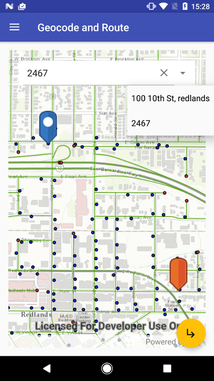

Geocode and Route
=======================
This app uses a local data to demonstrate an offline workflow. A mobile map package is used to display a map with operational data, and perform geocoding and routing. A tile cache is also used to display a basemap.

This was used in the 'ArcGIS Runtime SDKs: Working with apps online and offline' technical session at the Esri Developer Summit Europe, December 2016.

## APIs used
- `MobileMapPackage`
- `ArcGISTiledLayer`
- `LocatorTask`
- `RouteTask`

## Prerequisites
- Download the datasets used in this demo from ArcGIS Online on to your device; ensure they are both present in the `Download` folder on your device.
  - [SanFrancisco.mmpk](https://www.arcgis.com/home/item.html?id=8df86a1e63764cc2b62a51c80bcb99bc) - a mobile map package (.mmpk) containing a map, with a corresponding locator and network dataset.
  - [SanFrancisco.tpk](https://www.arcgis.com/home/item.html?id=786558f8c01247e0ac550b421c56a3ea) - a tile cache (.tpk) file used as the basemap layer for the map.
- App runs on Android API version 16 and above.
- Requires local data storage permissions; on Android API versions 23 (Marshmallow) and above permissions will be requested from the user at run time.
- Uses the 100.0.0 release of ArcGIS Runtime SDK for Android.

## Running the app
1. From the spinner, select the first address point to geocode, or type an address within the map area shown in San Francsico in to the search box and press enter.
  - The geocoded location is shown as a graphic on the map; a different symbol is used for the first found address (which is used as the Start location) and the second found address (which is used at the Finish location).
1. When two addresses have been geocoded, tap the floating action button to solve the route between the locations.
  - The route is shown as a graphic on the map.

## Licensing
Copyright 2016 Esri

Licensed under the Apache License, Version 2.0 (the "License"); you may not use this file except in compliance with the License. You may obtain a copy of the License at

http://www.apache.org/licenses/LICENSE-2.0

Unless required by applicable law or agreed to in writing, software distributed under the License is distributed on an "AS IS" BASIS, WITHOUT WARRANTIES OR CONDITIONS OF ANY KIND, either express or implied. See the License for the specific language governing permissions and limitations under the License.

A copy of the license is available in the repository's [license.txt](https://github.com/Esri/arcgis-runtime-demos-android/blob/master/license.txt) file.

For information about licensing your deployed app, see [License your app](https://developers.arcgis.com/android/guide/license-your-app.htm).
