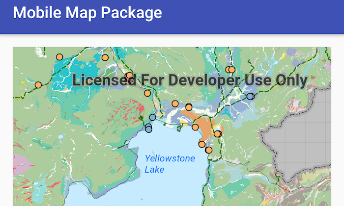

# Mobile Map Package
This sample demonstrates how to open and display a map from a Mobile Map Package. It is developed with the [Kotlin](http://kotlinlang.org/) programming language to demonstrate ArcGIS Android SDK support for Kotlin.



# Getting started with ArcGIS Android and Kotlin

## Using Gradle

### Configure dependencies
We need to add dependencies to the **kotlin-gradle-plugin** and the **kotlin** standard library:

Project root build.gradle:

```groovy
dependencies {
    classpath 'com.android.tools.build:gradle:1.2.3'
    classpath 'org.jetbrains.kotlin:kotlin-gradle-plugin:[version]'
}
```

App module build.gradle:

```groovy
dependencies {
    compile 'org.jetbrains.kotlin:kotlin-stdlib:[version]'
    compile 'com.esri.arcgisruntime:arcgis-android:100.0.0-[buildnum]'
}
```

### Configure kotlin-plugin
Add the _kotlin-plugin_ to your app module plugins in your app module build.gradle:

```groovy
apply plugin: 'com.android.application'
apply plugin: 'kotlin-android'
```

### Configure Kotlin source sets
Kotlin files go into your app module **src/main/kotlin** directory, update the following **sourceSets** to the _android_ method closure in your app module build.gradle:

```groovy
sourceSets {
    main.java.srcDirs += 'src/main/kotlin'
}
```

## Features
- MapView
- MobileMapPackage

## Sample Pattern
This sample takes a Mobile Map Package that was created in ArcGIS Pro, and displays a `Map` from within the package in a `MapView`. This is accomplished by calling `MobileMapPackage.loadAsyc()` and waiting for its load status to be completed. Once the package is loaded, you can access its maps, and assign one of the maps to be viewed in the `MapView`.

## Provision your device
1. Download the data from [ArcGIS Online](https://www.arcgis.com/home/item.html?id=e1f3a7254cb845b09450f54937c16061).  
2. Extract the contents of the downloaded zip file to disk.  
3. Create an ArcGIS/samples/MapPackage folder on your device. This requires you to use the [Android Debug Bridge (adb)](https://developer.android.com/guide/developing/tools/adb.html) tool found in **<sdk-dir>/platform-tools**.
4. Open up a command prompt and execute the ```adb shell``` command to start a remote shell on your target device.
5. Navigate to your sdcard directory, e.g. ```cd /sdcard/```.  
6. Create the ArcGIS/samples/MapPackage directory, ```mkdir ArcGIS/samples/MapPackage```.
7. You should now have the following directory on your target device, ```/sdcard/ArcGIS/samples/MapPackage```. We will copy the contents of the downloaded data into this directory. Note:  Directory may be slightly different on your device.
8. Exit the shell with the, ```exit``` command.
9. While still in your command prompt, navigate to the folder where you extracted the contents of the data from step 1 and execute the following command:
	* ```adb push Yellowstone.mmpk /sdcard/ArcGIS/samples/MapPackage```


Link | Local Location
---------|-------|
|[Yellowstone Mobile Map Package](https://www.arcgis.com/home/item.html?id=e1f3a7254cb845b09450f54937c16061)| `<sdcard>`/ArcGIS/samples/MapPackage/Yellowstone.mmpk |
